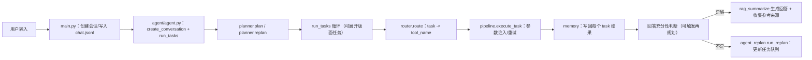

# BBS Agent - 智能论坛助手系统

## 🎯 项目概述

BBS Agent 是一个智能论坛助手系统，旨在帮助用户高效地搜索、检索和与论坛内容进行交互。该系统结合了包括大型语言模型（LLM）、向量数据库和网络爬虫在内的先进AI技术，为论坛知识管理提供全面的解决方案。

**核心功能：**
- 🧠 智能查询理解和处理
- 🔍 跨论坛版块的多级语义搜索
- 📊 具有实时更新的动态知识库
- 🎯 上下文感知的响应生成
- 🔄 自动化内容爬取和索引

## 🏗️ 系统架构

系统采用模块化、分层架构设计，具有良好的可扩展性和可维护性：

### 核心层级

```
┌──────────────────────────────────────────┐
│               应用层 (APP)               │
│  - 主应用入口点                        │
│  - Agent初始化和控制                   │
└──────────────────────────────────────────┘
                    │
                    ▼
┌──────────────────────────────────────────┐
│              核心层 (CORE)               │
│  agent.py           - 主控制器          │
│  planner.py         - 查询规划          │
│  router.py          - 工具路由          │
│  pipeline.py        - 工作流控制        │
│  memory.py          - 对话状态          │
└──────────────────────────────────────────┘
                    │
                    ▼
┌──────────────────────────────────────────┐
│              知识层 (KNOWLEDGE)          │
│  三层向量数据库系统：                   │
│  - 静态存储       - 论坛结构           │
│  - 动态存储       - 爬取内容           │
│  - 用户存储       - 用户上传           │
└──────────────────────────────────────────┘
                    │
                    ▼
┌──────────────────────────────────────────┐
│              工具层 (TOOLS)              │
│  - 网络爬虫                            │
│  - 搜索工具                            │
│  - 数据处理工具                        │
└──────────────────────────────────────────┘
                    │
                    ▼
┌──────────────────────────────────────────┐
│            基础设施层 (INFRASTRUCTURE)   │
│  - 向量数据库 (Chroma)                  │
│  - 浏览器管理 (Playwright)              │
│  - 嵌入模型                            │
│  - 配置管理                            │
└──────────────────────────────────────────┘
```

## 📁 项目结构

```
BBS_Agent/
├── agent/                           # 核心编排与会话控制
│   ├── agent.py                    # 单轮问答入口（编排中心）
│   ├── agent_task.py              # run_tasks 循环/展开/重试与 replan 协调
│   ├── agent_plan.py               # 默认/合成任务表的数据结构
│   ├── agent_replan.py             # replan 入口
│   ├── planner.py                  # 规划与规则式重规划
│   ├── router.py                   # task -> tool 路由
│   ├── pipeline.py                 # 工具执行（参数注入/重试/统一结果）
│   ├── memory.py                   # 会话与任务结果写回
│   └── tools/                      # 工具层（薄封装，承接参数适配）
│       ├── initialize/             # 初始化/向量加载
│       ├── query/                  # 查询工具
│       ├── search/                 # 搜索/爬取工具
│       └── summarize/             # RAG 总结与回答生成
├── infrastructure/                 # 基础设施层（技术能力）
│   ├── browser_manager/          # Playwright 浏览器控制
│   ├── browser_manager_ts/       # TS 端浏览器管理（适配）
│   ├── model_factory/            # 模型工厂（embedding/LLM 路由）
│   └── vector_store/             # Chroma 向量库服务
├── knowledge/                      # 知识与检索实现细节
│   ├── ingestion/                 # 数据摄取
│   ├── processing/                # 数据处理/清洗/标注
│   ├── retrieval/                 # 检索与重排序
│   └── stores/                    # 静态/动态/用户向量存取与索引
├── config/                         # 配置文件（JSON）
│   ├── data/                      # 数据维度/派生配置
│   ├── driver/                    # 浏览器驱动配置
│   ├── model/                     # 模型配置
│   ├── prompts/                   # prompt 路径/模板选择
│   ├── vector_store/             # 向量库/集合配置
│   └── websites/                  # 论坛站点/站点列表
├── data/                           # 输入数据与爬取产物
│   ├── static/                    # 静态论坛数据
│   ├── dynamic/                   # 动态爬取数据
│   ├── store/                     # 用户上传数据
│   ├── web_structure/           # 论坛结构数据
│   └── test/                      # 测试/样例数据
├── vector_db/                      # Chroma 持久化目录（静态/动态/用户）
│   ├── static/
│   ├── dynamic/
│   └── store/
├── utils/                          # 通用工具
├── logs/                           # 应用日志
├── prompts/                        # LLM 提示模板（文本/多段）
├── main.py                         # 应用入口点（CLI 对话）
├── test.py                         # 本地测试脚本
└── requirements.txt                # 依赖包
```

## 🧱 分层重构计划（来自 `.cursor/plans`）

当前仓库已经实现了“单轮问答 -> 规划 -> 任务循环 -> replan -> 充分性判断 -> RAG 生成”的闭环。接下来重点是把业务编排从 `tools` 里逐步抽离，形成可长期扩展的分层架构。

### P0（先做：解耦与可维护）
- 新增 `agent/services` 骨架：`query/crawler/indexing/safety` 等服务接口
- 将 `agent/tools/search`、`agent/tools/initialize` 改为“薄封装”，只负责参数适配并调用 services
- 消除导入副作用（尤其是 store 初始化），统一显式 `bootstrap` 初始化流程
- 建立最小端到端冒烟测试：提问 -> 按需抓取 -> 向量化 -> 检索回答（固化回归基线）

### P1（再做：质量与稳定性）
- 增量任务（游标、重试、幂等键）
- 增加 rerank 插槽，保留可选开关
- 为 `config` 引入 schema 校验（Pydantic）
- 离线评估脚本（Recall@k、MRR、命中率等）

### P2（后续：微调模型产品化）
- `model_registry` + `model_router`：模型按任务可配置路由
- 训练/评估流水线（版本化、样本抽取与清洗）
- 灰度切换与回滚：`base` / `ft-*` 模型路径可控

### 目标边界（验收准则）
- `tools`：不直接触达浏览器/向量库，只做入口与参数适配
- services：承载业务编排核心（Query/Crawler/Indexing/Safety）
- infrastructure：只提供技术能力
- knowledge：逐步收敛为检索与索引实现细节

## 🚀 开发历程

基于git历史分析，项目经历了以下几个关键阶段：

### 第一阶段：基础建设 (2026-03-02)
- **Init agent**: 基础agent框架搭建
- **Update framework**: 核心系统架构

### 第二阶段：数据基础设施 (2026-03-03)
- **Add vector store**: 多层向量数据库实现
- **Init initialize tools**: 工具系统基础

### 第三阶段：核心功能 (2026-03-04)
- **Init search function**: 基础搜索功能

### 第四阶段：高级功能 (2026-03-05)
- **Update batch crawl**: 自动化内容爬取
- **Update agent framework**: 增强agent能力
- **Update plan function**: 改进规划系统

### 第五阶段：LLM集成 (2026-03-06)
- **Update planner**: 基于LLM的查询规划

## 🔧 核心组件

### 向量存储系统
系统实现了复杂的三层向量数据库：

1. **静态存储** (`vector_db/static/`)
   - 论坛结构摘要
   - 版块介绍和元数据
   - 稳定的长期知识

2. **动态存储** (`vector_db/dynamic/`)
   - 实时爬取的论坛内容
   - 时效性信息
   - 频繁更新的数据

3. **用户存储** (`vector_db/store/`)
   - 用户上传的文档
   - 自定义知识库
   - 个性化内容

### 配置管理
- **基于JSON的配置**: 模块化、易于维护的配置
- **环境特定设置**: 开发/生产环境分离
- **动态重载**: 运行时配置更新

### 工具系统
- **模块化工具架构**: 易于扩展和维护
- **工具发现**: 自动工具注册
- **依赖注入**: 关注点清晰分离

## 🛠️ 技术栈

- **Python 3.8+**: 核心编程语言
- **LangChain**: LLM应用框架
- **Chroma**: 向量数据库
- **Playwright**: 网页自动化和爬取
- **Transformers**: NLP模型集成
- **Hugging Face**: 嵌入模型
- **Beautiful Soup**: HTML解析

## 🔁 单轮问答闭环（当前实现）



执行要点（对应代码模块）：
- `main.py`：读取用户输入，首问创建 `usr_history/<首问摘要>/`；每轮写入 `chat.jsonl`，会话结束生成可读的 `chat.txt`
- `agent/agent.py`：初始化 conversation/context，使用 `planner.plan` 得到默认 to-do 表；通过 `run_tasks` 执行 Router->Pipeline->tools，并在结果不足时触发 `run_replan`
- `agent/agent_task.py`：在 replan_count 限制内执行任务队列；当需要按版面展开时，会把后续任务展开为 `3-x/4-x` 形式
- `agent/router.py` + `agent/pipeline.py`：负责路由与统一执行记录（execution_record），并把结果写回 Memory
- `agent/tools/summarize/rag_summarize.py`：用 prompt 模板生成层级化、口语化的回答，并附带【参考来源】

## 🚀 快速开始

### 前置要求
```bash
pip install -r requirements.txt
playwright install
```

### 基础使用
```python
# 运行测试脚本
python test.py

# 启动主应用
python main.py
```

### 配置
1. 编辑 `config/vector_store/` 目录下的JSON文件配置数据库设置
2. 在 `prompts/` 目录配置提示词
3. 在配置文件中设置数据路径

## 🔮 优化建议

### 立即改进
1. **增强错误处理**: 添加全面的错误处理和日志记录
2. **性能优化**: 实现缓存和异步操作
3. **测试框架**: 添加单元测试和集成测试
4. **文档**: 扩展API文档和使用示例

### 中期增强
1. **高级缓存**: 为频繁查询实现Redis/内存缓存
2. **实时更新**: WebSocket支持实时论坛更新
3. **多语言支持**: 国际化和本地化
4. **用户认证**: 安全访问控制和用户管理

### 长期愿景
1. **多Agent协作**: 分布式agent系统
2. **高级分析**: 用户行为分析和洞察
3. **移动应用**: 原生移动应用集成
4. **API网关**: 用于外部集成的RESTful API

## 📈 性能考虑

- **向量数据库优化**: 块大小调整、索引优化
- **内存管理**: 高效的对话状态处理
- **并发处理**: 多线程爬取和处理
- **资源监控**: 系统健康和性能指标

## 🔒 安全考虑

- **输入验证**: 清理所有用户输入
- **速率限制**: 防止滥用和DoS攻击
- **数据隐私**: 安全处理用户数据
- **认证**: 敏感操作的安全访问

## 🤝 贡献指南

1. Fork 仓库
2. 为新功能创建特性分支
3. 为新功能添加测试
4. 更新文档
5. 提交拉取请求

## 📞 支持

如有问题、议题或贡献，请使用GitHub议题跟踪器或联系开发团队。
